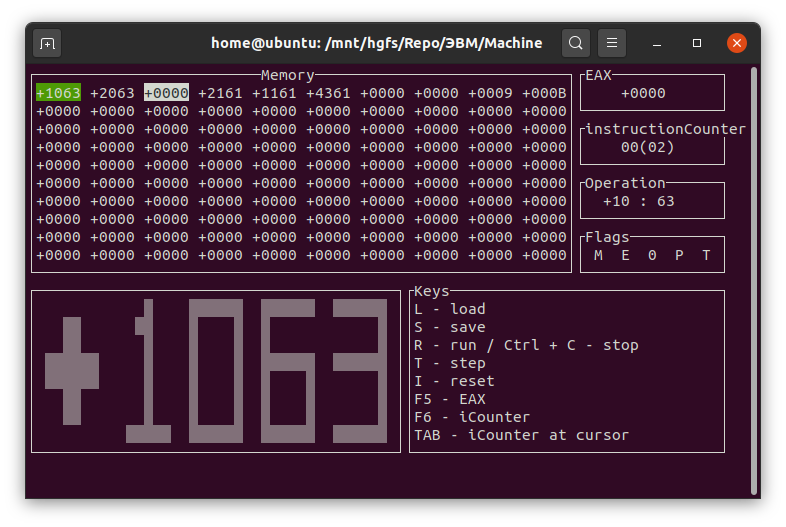

# Simple computer
Simulate a simple computer. 
The task is described in detail [here](./Coursework%20Report%20without%20code.docx).
## Requirements
Unix
gcc
## Build
To build a project, run `./make.sh` in the project folder.
## Preview

