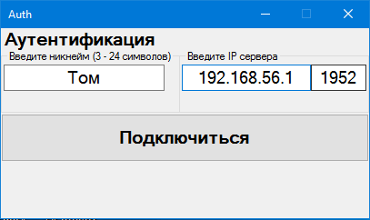

# Socket-based multithreaded chat
Socket Based Multiplayer Chat. 
The task is described in detail [here](./Coursework%20Report.docx).
## Requirements
.Net Framework
## Build
To build a project, run `./Chat.sln` in the project folder.
## Preview

