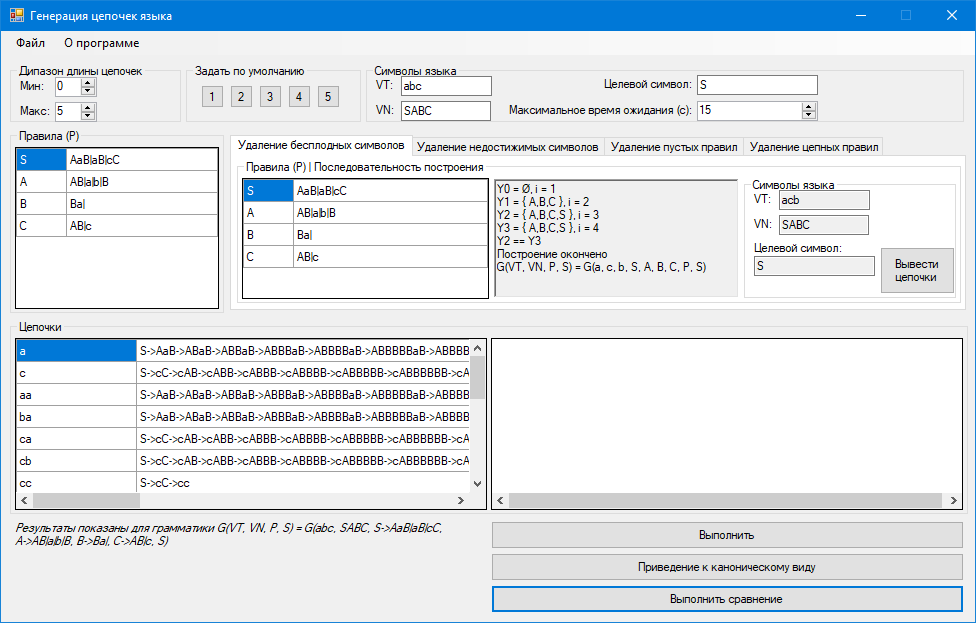

# Languages And Translation Methods
The program converts grammar to canonical form.
The task is described in detail [here](./Coursework%20Report.doc).
## Requirements
.Net Framework 4.6.1
## Build
To build a project, run `lab5.sln` in the project folder
## Preview

