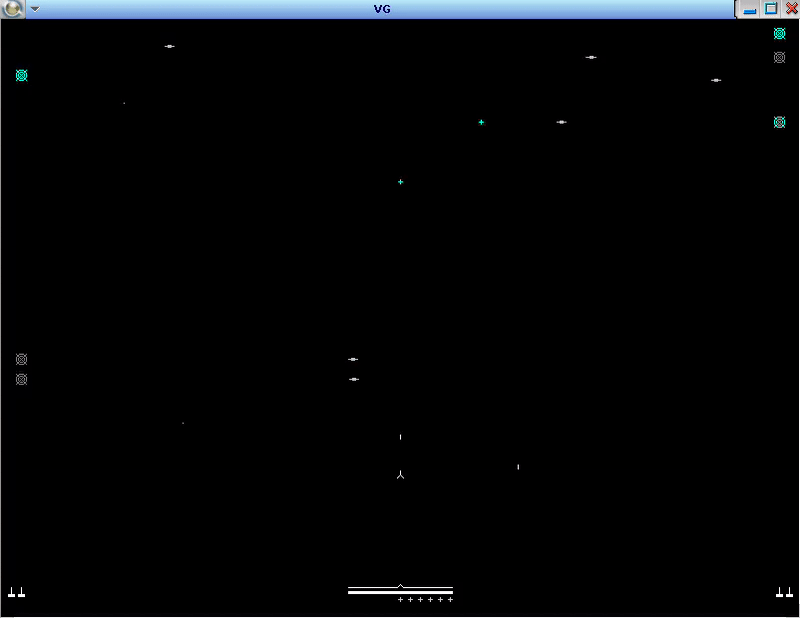

# Air defense system
The task is to programmatically control the rocket launcher (it is almost impossible to manually cope with the task of destroying plates).  
That is, you just need to write the command to the register at the right time. 
The task is described in detail [here](./Lab%204.pdf).
## Requirements
QNX 5.0. 
More detailed requirements are located [here](http://cyber.sibsutis.ru:82/ОСРВ/QNX650/!_readme.txt).
## Build
To build a project, enter the command `./sc.sh` in the project folder.
## Preview

