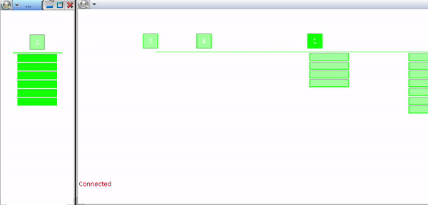

# Power Station
This program simulates the operation of a power station and displays on the screen the process of its operation using data transmission over the network.
The task is described in detail [here](./Lab%203.pdf).
## Requirements
QNX 5.0. 
More detailed requirements are located [here](http://cyber.sibsutis.ru:82/ОСРВ/QNX650/!_readme.txt).
## Build
To build a project, enter the command `./sc.sh` in the project folder
## Preview

